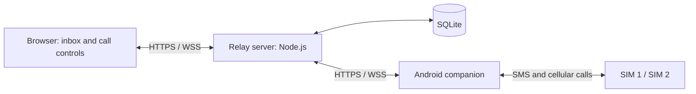

<div align="center">


# Relay

**Your SIMs. Your browser. Your server.**

A self-hosted SMS, contacts, and cellular calling gateway for an Android phone.

[Getting started](#getting-started) · [Phone setup](docs/ANDROID.md) · [Architecture](#how-it-works) · [Known limits](#known-limits)

</div>

---

## Why this exists

I needed a practical way to use a phone's two SIMs remotely: read and reply to texts, keep contacts in sync, and take real cellular calls from a browser.

**This is a vibe-coded project, built with Codex to satisfy that personal need.** It grew through hands-on testing on one Xperia, plenty of trial and error, and fixes to the things that actually got in the way. I'm sharing it in case it solves a similar problem for someone else—or gives them a useful starting point.

It works in my setup. It is still experimental, especially the device-specific live audio path. Expect rough edges, not universal Android compatibility.

## What it does

| | Features |
| --- | --- |
| **Messages** | Send and receive SMS, choose a SIM, import existing history, search, unread filters, pin/archive, and delete. |
| **Calls** | Dial, answer, and end cellular calls from the browser; stream live audio; mute, adjust output/volume, and use the in-call keypad. |
| **Contacts** | Import phone contacts, add/edit/delete names and numbers, and call directly after choosing a SIM. |
| **Sync** | Synchronize supported message, call-log, contact, and blocked-number changes with the paired phone. Pending changes stay visible. |
| **Multiple browsers** | One browser owns call audio at a time. **Use audio here** explicitly moves it to the browser you're using. |
| **Interface** | Responsive desktop/mobile layout, light/dark/system themes, and browser call and SMS notifications where supported. |
| **Self-hosting** | Private accounts, single-use phone pairing, a dedicated SQLite database, and no public registration. |

The phone connects to your server over the network. USB is used for development, installation, and diagnostics; normal remote use does not depend on keeping a laptop attached.

## How it works



- **Web:** React, Vite, Lucide icons, locally bundled fonts.
- **Server:** Express, Node's SQLite module, authenticated HTTP and WebSocket APIs.
- **Phone:** Android companion in Java, plus a small native C uplink helper for the tested Xperia.
- **Audio:** Live 16 kHz mono PCM over WebSockets. Audio is not stored by the server. This is not a WebRTC or SIP gateway.

## Compatibility

The working phone setup is a **Sony Xperia XZ F8332**, **Android 8.0.0**, build **41.3.A.2.192**, **arm64**, with **Magisk root**. Both SIMs have passed audible uplink tests; browser-to-phone conversation has worked in live use.

The live audio helper is deliberately tied to that model and firmware. An ordinary unrooted Android app cannot be assumed to access or inject cellular call audio. Other phones require their own implementation and physical verification.

The website has been used in Windows desktop browsers and Android Chrome. Full acceptance on iPhone Safari and macOS Safari remains unverified.

## Getting started

### Run the website and server

Install **Node.js 24.15+ within the 24.x line** and Git.

```sh
git clone https://github.com/Cheeseburger08/relay.git
cd relay
npm ci
npm run build
npm run account -- --username owner
npm start
```

The account command prompts for a password. There are **no default credentials**.

Open **http://127.0.0.1:49760**. This starts an empty private workspace; connect a phone to use SMS and calls.

If that port is unavailable, copy `.env.example` to `.env` and change both `PORT` and `PUBLIC_ORIGIN`. The browser URL must match `PUBLIC_ORIGIN` exactly.

### Connect the phone

1. Follow [Android build and setup](docs/ANDROID.md). The native uplink must be built before the companion APK.
2. For remote use, deploy the server with HTTPS using [the hosting guide](docs/SETUP.md).
3. Sign in, open **Device**, and create a pairing code.
4. Enter your server's full URL and the code in **Relay Companion** on the phone.
5. Grant the required permissions and explicitly enable Relay.
6. Verify SMS and a consenting test call on each SIM before relying on it.

There is no universal installer, included firmware, or prebuilt signed APK in this repository.

## Known limits

- **Call reliability is still being evaluated.** Live audio works, and uplink latency has improved, but intermittent choppiness/disconnections have occurred. Longer-call reliability is not proven.
- **Reconnect is best effort.** The call path has a 60-second recovery window; restored connectivity does not guarantee a seamless call.
- **Speaker selection depends on the browser.** Android Chrome did not reliably expose/switch between the earpiece and loudspeaker. Safari behavior still needs real-device testing.
- **Browser permissions still apply.** Microphone, autoplay, push, and background execution restrictions can require user interaction. iPhone notifications may require a Home Screen installation.
- **Contact sync covers names and numbers**, not photos, email addresses, or groups. Read-only accounts and conflicting/offline edits can leave changes pending.
- **SMS only:** no MMS or RCS. Carrier delivery reports are not always available. Claimed SMS commands are not blindly retried, to avoid duplicate sends.
- **Small deployment design:** one server process, SQLite, and one paired phone per account. No high-availability deployment or carrier-grade guarantees.
- **No independent security audit.** Read [SECURITY.md](SECURITY.md) before exposing an instance.

## Privacy and security

Use Relay only with phones and SIMs you own or have permission to operate. Pairing and the phone's enabled state are explicit and visible.

HTTPS/WSS protect traffic. Stored sensitive content is encrypted, but **the server can read it**: this is not end-to-end encryption against the host. Runtime data, encryption keys, push keys, backups, signing material, and personal logs belong outside Git.

## Development

```sh
npm ci
npm run dev       # local development server
npm test          # API, sync, audio, and browser-client unit tests
npm run build    # production web assets
```

The core automated suite currently contains 26 tests. These test contracts and simulated behavior; they do not replace physical two-SIM audio tests.

For the isolated browser integration test, build the web assets, run `npx playwright install chromium`, then `npm run test:browser`. It creates a temporary database and synthetic account; it does not use your phone or production instance.

```text
src/             React interface and browser audio client
server/          Accounts, storage, synchronization, and voice relay
android/app/     Phone companion
android/native/  Xperia-specific native audio helper
android/audio-probe/   Experimental audio diagnostics
android/local-backup/  Local backup/restore utility
scripts/         Build, diagnostic, and backup tools
tests/           Automated tests and browser integration script
docs/            Setup and API documentation
```

[API contract](docs/API.md) · [Contributing](CONTRIBUTING.md) · [Security](SECURITY.md)

## Contributing

Fixes, clearer setup instructions, and well-documented compatibility reports are welcome. For audio changes, include the exact phone, firmware, SIM, browser, and what each caller actually heard. Passing a synthetic test alone does not prove a working cellular audio route.

Please use synthetic data in issues and pull requests. Never upload private texts, contact lists, phone numbers, device identifiers, credentials, or call recordings.

## License

[MIT](LICENSE). Third-party dependencies retain their own licenses. Android firmware, device libraries, Magisk, and build tools are not included.
